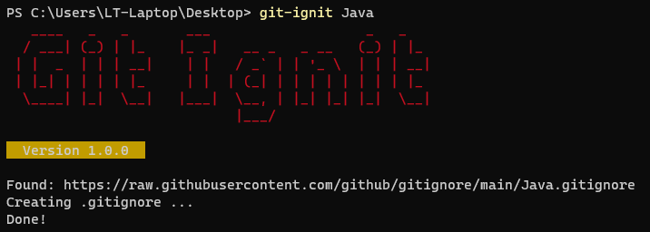

# Git Ignit

Download Github .gitnore templates superfassst!

### Installation

Coming soon...

### Building

`$ go build`
`$ go install`

### Testing

In the projects root directory run:

`$ go test -v ./...`

### Usage

Shorthand:
`$ git-ignit Java`

Full-Name:
`$ git-ignit Swift.gitignore`

### Behaviour

* The `.gitignore` file will be created in the current working / caller directory.
* Already existing .gitignore(s) won't be overwritten.

### Todos

* [ ] GitHub Workflow CI/CD
* [ ] File Overwrite optional option
* [ ] Cache template files
* [ ] Add & manage custom templates
* [ ] Unit-Tests
